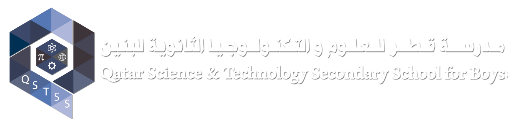

# AI Smart Badge 



## Table of Contents
- [Overview](#overview)
- [Features](#features)
- [Demo](#demo)
- [Installation](#installation)
  - [Prerequisites](#prerequisites)
  - [Installation Steps](#installation-steps)
- [Usage](#usage)
  - [Main Menu](#main-menu)
  - [Add / Manage Gestures](#add--manage-gestures)
  - [Collect Data](#collect-data)
  - [Train Model](#train-model)
  - [Translate Gestures](#translate-gestures)
  - [Reverse Translate](#reverse-translate)
  - [Continuous Translate](#continuous-translate)
  - [User/Guest Window](#userguest-window)
- [Project Structure](#project-structure)
- [Dependencies](#dependencies)
- [Troubleshooting](#troubleshooting)
- [Contributing](#contributing)
- [License](#license)
- [Acknowledgements](#acknowledgements)

## Overview

The AI Smart Badge Platform is an advanced gesture recognition and voice transcription system designed to interact seamlessly with users through gestures and speech. Initially developed for Raspberry Pi, this platform has been adapted to run on standard laptops, leveraging powerful machine learning models and intuitive GUI interfaces.

## Features

- Add / Manage Gestures: Easily add, modify, or delete gestures, supporting both Arabic and English.
- Data Collection: Collect and store gesture data using your laptop's webcam.
- Model Training: Train a custom gesture recognition model using collected data.
- Gesture Translation: Translate recognized gestures into speech with support for multiple languages.
- Reverse Translation: Convert spoken words into corresponding gestures using AI-powered speech recognition.
- Continuous Translation: Continuously detect and translate gestures in real-time.
- User/Guest Interface: Separate interfaces for user and guest interactions, enabling versatile use cases.
- Multilingual Support: Supports both English and Arabic languages, ensuring accessibility for a diverse user base.


## Installation

### Prerequisites

- Operating System: Windows, macOS, or Linux
- Python: Version 3.7 or higher
- Webcam: Integrated or external webcam for gesture recognition
- Microphone: For voice input and transcription
- Internet Connection: Required for initial setup and certain functionalities

### Installation Steps

1. Clone the Repository

   
   git clone https://github.com/yourusername/ai-smart-badge.git
   cd ai-smart-badge
   

2. Create a Virtual Environment (Optional but Recommended)


   python -m venv venv
   source venv/bin/activate  # On Windows: venv\Scripts\activate
   ```

3. Install Dependencies

   Ensure you have `pip` updated:


   pip install --upgrade pip
   ```

   Install required Python packages:


   pip install -r requirements.txt
   ```

   Note: For `pyaudio`, you might need additional system dependencies:

   - Windows: Install from [PyAudio Downloads](https://www.lfd.uci.edu/~gohlke/pythonlibs/#pyaudio).
   - Linux: 

  
     sudo apt-get install portaudio19-dev
     pip install pyaudio
     ```

   - macOS:

  
     brew install portaudio
     pip install pyaudio
     ```

4. Download Whisper Model

   The application uses OpenAI's Whisper for speech recognition. Download the appropriate model:


   pip install -U openai-whisper
   ```

   Note: Depending on your system's capabilities, you can choose different Whisper models (e.g., `tiny`, `base`, `small`, `medium`, `large`). The `small` model is recommended for a balance between speed and accuracy.

5. Prepare Assets

   - Gestures Data:
     - Ensure the `gesture_data/gestures.txt` file exists. If not, create it.
   - Gesture Images:
     - Place gesture images in the `gesture_images/` directory. Each image should be named after the gesture (e.g., `wave.png`).
   - Fonts:
     - Ensure the `Amiri-Bold.ttf` font file is available in the project directory or update the `font_path` in the script to point to a valid font on your system.
   - Loading Indicator:
     - Place a `loading.gif` in the project directory for visual feedback during processing.

6. Run the Application


   python main.py
   ```

   Replace `main.py` with the actual script filename if different.

## Usage

### Main Menu

Upon launching the application, you'll be greeted with the Main Menu, displaying the project title and various options:

- Add / Manage Gestures
- Collect Data
- Train Model
- IoT Dataset Upload
- Translate Gestures
- Reverse Translate
- Continuous Translate
- User/Guest Window
- Exit

### Add / Manage Gestures

Manage your gesture library by adding new gestures, modifying existing ones, or deleting unwanted gestures. Supports both Arabic and English gesture names.

### Collect Data

Collect gesture data using your webcam. Select a gesture from the list and start collecting samples. The system requires a minimum number of samples (e.g., 200) to ensure model accuracy.

### Train Model

Train the gesture recognition model using the collected data. This process involves:

1. Loading gesture landmarks from the CSV file.
2. Preprocessing and splitting the data.
3. Building and training a neural network model.
4. Saving the trained model, scaler, and label encoder for future use.

### IoT Dataset Upload

Upload your gesture dataset to IoT platforms or integrate with other applications as needed. (Ensure `roboflow.py` is correctly configured for your IoT platform.)

### Translate Gestures

Translate recognized gestures into speech. The system supports multiple languages, including Arabic and English.

### Reverse Translate

Convert spoken words into corresponding gestures using AI-powered speech recognition (Whisper). Speak the gesture name, and the system will display the matching gesture image.

### Continuous Translate

Continuously detect and translate gestures in real-time. The system maintains a sequence of detected gestures, providing seamless interaction.

### User/Guest Window

Separate interfaces for user and guest interactions, enabling versatile use cases such as collaborative environments or restricted access scenarios.

### Exit

Safely exit the application. All resources, including webcam and audio streams, are properly released upon exit.

## Project Structure

```
ai-smart-badge/
├── gesture_data/
│   ├── gestures.txt
│   └── gesture_landmarks.csv
├── gesture_images/
│   ├── wave.png
│   ├── thumbs_up.png
│   └── ... (other gesture images)
├── models/
│   ├── gesture_recognition_model.keras
│   ├── scaler.save
│   └── label_encoder.save
├── fonts/
│   └── Amiri-Bold.ttf
├── assets/
│   └── loading.gif
├── scripts/
│   ├── roboflow.py
│   └── voicetotext.py
├── main.py
├── README.md
└── requirements.txt
```

- gesture_data/: Contains gesture names and their corresponding landmarks.
- gesture_images/: Stores images representing each gesture.
- models/: Holds the trained machine learning model and associated preprocessing tools.
- fonts/: Contains font files used for rendering Arabic text.
- assets/: Includes multimedia assets like loading indicators.
- scripts/: Auxiliary scripts for additional functionalities (e.g., IoT uploads, voice-to-text).
- main.py: The primary application script.
- README.md: This documentation file.
- requirements.txt: Lists all Python dependencies.

## Dependencies

Ensure all dependencies are installed as outlined in the [Installation](#installation) section. Key dependencies include:

- GUI & Interface:
  - [PyQt5](https://pypi.org/project/PyQt5/)
- Audio & Speech:
  - [pyaudio](https://pypi.org/project/PyAudio/)
  - [speechrecognition](https://pypi.org/project/SpeechRecognition/)
  - [pyttsx3](https://pypi.org/project/pyttsx3/)
  - [gTTS](https://pypi.org/project/gTTS/)
  - [playsound](https://pypi.org/project/playsound/)
- Image & Video Processing:
  - [OpenCV](https://pypi.org/project/opencv-python/)
  - [Pillow](https://pypi.org/project/Pillow/)
- Machine Learning:
  - [TensorFlow](https://pypi.org/project/tensorflow/)
  - [scikit-learn](https://pypi.org/project/scikit-learn/)
  - [joblib](https://pypi.org/project/joblib/)
- Natural Language Processing:
  - [whisper](https://github.com/openai/whisper)
  - [arabic-reshaper](https://pypi.org/project/arabic-reshaper/)
  - [python-bidi](https://pypi.org/project/python-bidi/)
- Others:
  - [mediapipe](https://pypi.org/project/mediapipe/)
  - [numpy](https://pypi.org/project/numpy/)
  - [pandas](https://pypi.org/project/pandas/)
  - [wave](https://docs.python.org/3/library/wave.html)
  - [pyaudio](https://pypi.org/project/PyAudio/)
  - [subprocess](https://docs.python.org/3/library/subprocess.html)

## Troubleshooting

### Common Issues

1. Webcam Access Failure
   - Symptom: Error message stating "Cannot access webcam."
   - Solution: Ensure no other application is using the webcam. Check webcam drivers and permissions.

2. Microphone Access Failure
   - Symptom: Error during audio recording.
   - Solution: Verify microphone permissions and that the microphone is properly connected and functioning.

3. Missing Font File (`Amiri-Bold.ttf`)
   - Symptom: Arabic text not rendering correctly.
   - Solution: Ensure the font file is placed in the specified directory or update the `font_path` in the script to a valid font on your system.

4. Audio Playback Issues
   - Symptom: Speech synthesis not playing.
   - Solution: Ensure `playsound` is installed correctly. On some systems, additional audio backend configurations may be required.

5. Whisper Model Loading Failure
   - Symptom: Error message during model loading.
   - Solution: Ensure that the `whisper` package is installed and the model files are correctly downloaded.

6. PyAudio Installation Issues
   - Symptom: Errors during `pyaudio` installation.
   - Solution: Follow platform-specific installation steps. For Windows, use precompiled binaries. For Linux/macOS, install required system libraries before installing via `pip`.

### Additional Help

If you encounter issues not covered here, consider the following steps:

- Check Logs: Review console output for detailed error messages.
- Consult Documentation: Refer to the official documentation of the problematic library.
- Seek Community Support: Visit forums like [Stack Overflow](https://stackoverflow.com/) or the project's GitHub repository for assistance.
- Reinstall Dependencies: Sometimes, reinstalling can resolve unforeseen issues.

## Contributing

Contributions are welcome! Whether it's improving the code, adding new features, or enhancing documentation, your efforts are appreciated.

1. Fork the Repository
2. Create a Feature Branch

   git checkout -b feature/YourFeature
   ```
3. Commit Your Changes

   git commit -m "Add Your Feature"
   ```
4. Push to the Branch

   git push origin feature/YourFeature
   ```
5. Open a Pull Request

Please ensure that your code adheres to the project's coding standards and that all tests pass.

## License

This project is licensed under the [MIT License](LICENSE).

## Acknowledgements

- OpenAI: For the Whisper speech recognition model.
- MediaPipe: For robust hand tracking solutions.
- PyQt5: For providing a powerful GUI framework.
- Developers and Contributors: For their invaluable contributions to open-source libraries used in this project.

---

*Developed by AI Pioneers Team - Qatar*
